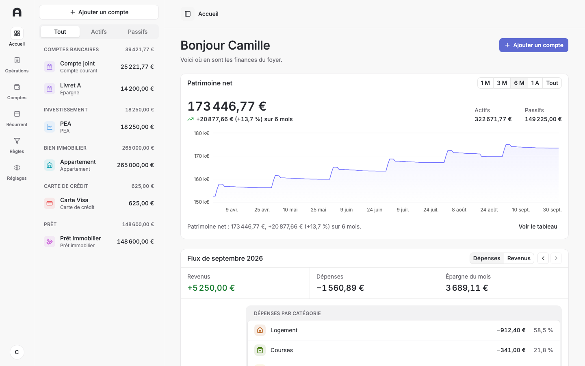
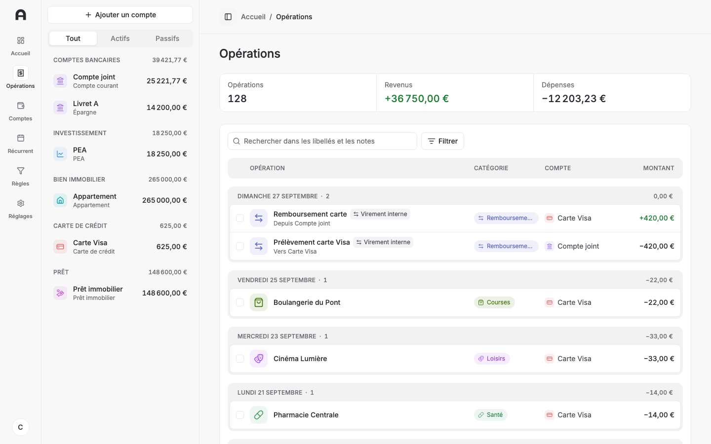

# Archant

[](https://github.com/leger-dosage/archant/actions/workflows/ci.yml?query=branch%3Amain)
[](LICENSE)
[](https://github.com/leger-dosage/archant/releases/latest)

Self-hosted personal finance for one household. Your bank syncs through Enable Banking (PSD2), and your data lands in your own SQLite database and stays there.

Archant re-implements the parts of [Sure](https://github.com/we-promise/sure) that a single household actually uses, on a stack light enough to run on a single small server or a machine at home.

Know its limits before you install it:

- The interface is in French only.
- Totals and reports are in euros, the one reporting currency. An account in another currency keeps its own balance but stays out of the totals, with no exchange rates.
- One household, one administrator account: there is no sign-up and no sharing between users.
- Bank synchronisation goes through [Enable Banking](https://enablebanking.com) only, which covers European banks and needs an application registered with it. File import works without it.





## Tech stack

| Layer          | Choice                                  |
| -------------- | --------------------------------------- |
| Language       | TypeScript 7                            |
| Interface      | Vite + React, TanStack Router and Query |
| Server         | Hono                                    |
| Database       | SQLite through Drizzle ORM              |
| Authentication | Better Auth                             |
| Bank data      | Enable Banking (PSD2)                   |
| Tests          | Vitest, Playwright                      |
| Packaging      | pnpm workspaces                         |

Why these, and what was rejected: [docs/adr/0001-technology-stack.md](docs/adr/0001-technology-stack.md).

## Features

Everything below works without a bank connection except the last line. [docs/sure-parity.md](docs/sure-parity.md) compares each area with Sure, and says what Archant does differently and why.

- Accounts: checking, savings, credit card, loan, investment (PEA, assurance vie, compte-titres), property and vehicle, with a daily balance history and dated balance snapshots.
- Transactions entered by hand, filtered across accounts, and edited in bulk.
- Import of OFX, CSV (with a saved column mapping) and QIF files, with a preview, deduplication, an import history and revert.
- Categories, merchants and tags, and rules that categorise, tag, rename or exclude new and existing transactions.
- Transfers between accounts, marked by hand or matched automatically.
- Recurring transactions, detected from history and listed with their next date.
- A dashboard with net worth over time and monthly income and expenses by category.
- One administrator account, created on first launch, with a password reset from the server's shell.
- Bank synchronisation through Enable Banking: connect a bank, link its accounts, sync transactions and balances on a schedule or on demand, keep pending card payments, renew or disconnect, and merge or dismiss a possible duplicate.

## Structure

The three packages exist; each grows only with the features that need it.

```
packages/
  app/    Vite + React single-page app
  api/    Hono server, REST and scheduled sync
  data/   Drizzle schema and database client shared by both
docs/     Project documentation, architecture and decision records
```

`_bmad-output/` holds the planning documents and one record per story: what was asked, what was decided and how it was reviewed.

## Prerequisites

Node.js 24+, pnpm 10+.

## Getting started

```bash
git clone https://github.com/leger-dosage/archant.git
cd archant
pnpm install --frozen-lockfile
cp .env.example .env
```

Set `BETTER_AUTH_SECRET` in `.env`, from `openssl rand -base64 32`: the API refuses to start without it. Then, in separate terminals:

```bash
pnpm api start:dev        # API on http://localhost:8787; migrates local.db at the repository root first
pnpm app start:dev        # interface on http://localhost:5173, proxies /api to the API
```

The database is the SQLite file `local.db` at the repository root, which the API creates and migrates when it starts, so no container or database server is needed. Open http://localhost:5173 and create the administrator, with the setup token the `pnpm api start:dev` terminal prints while no user exists, in the `msg` of a JSON log line: `Setup is open. Open /setup and enter the setup token <token>. A new one is printed at every start.` `pnpm data migrate:local` applies migrations without starting the API. To connect a bank in development, see [Connecting a bank](docs/deployment.md#connecting-a-bank).

## Scripts

| Command             | What it does                       |
| ------------------- | ---------------------------------- |
| `pnpm format`       | Format and sort imports with Oxfmt |
| `pnpm lint:code`    | Lint every package, warnings fail  |
| `pnpm lint:format`  | Check formatting without writing   |
| `pnpm typecheck`    | Type-check every package           |
| `pnpm test`         | Run unit and integration tests     |
| `pnpm test:e2e`     | Run the Playwright suite           |
| `pnpm api <script>` | Run a script inside `@archant/api` |

`pnpm app` and `pnpm data` do the same for the two other packages. `pnpm test:e2e` needs Chromium once per machine: `pnpm --filter @archant/app exec playwright install chromium`.

## Deploying

The reference target is a single container serving the interface and the API against a SQLite file on a volume, with no cloud account:

```bash
export BETTER_AUTH_SECRET="$(openssl rand -base64 32)"
docker compose up --build --detach --wait
```

Open http://localhost:8787 and create the administrator. [docs/deployment.md](docs/deployment.md) covers the variables, reverse proxies, upgrades, backups, connecting a bank in sandbox or production, the scheduled sync, password reset and other targets. [docs/hosting.md](docs/hosting.md) walks through hosting at home, reachable only through Tailscale, and connecting a real bank.

## Contributing

Read [CONTRIBUTING.md](CONTRIBUTING.md): how to report a bug, propose a feature, set up, and open a pull request. Something not working? See [docs/troubleshooting.md](docs/troubleshooting.md) and [SUPPORT.md](SUPPORT.md). What Archant encrypts and what leaves your server: [docs/security-model.md](docs/security-model.md).

## License

[GNU Affero General Public License v3.0](LICENSE). If you run a modified version as a network service, you must publish your changes.
