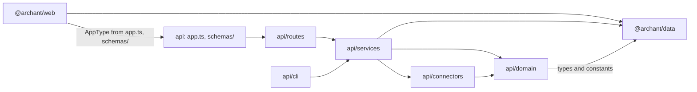
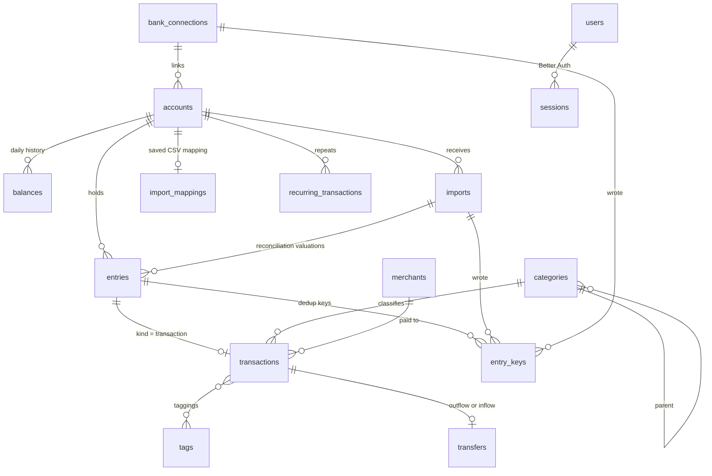
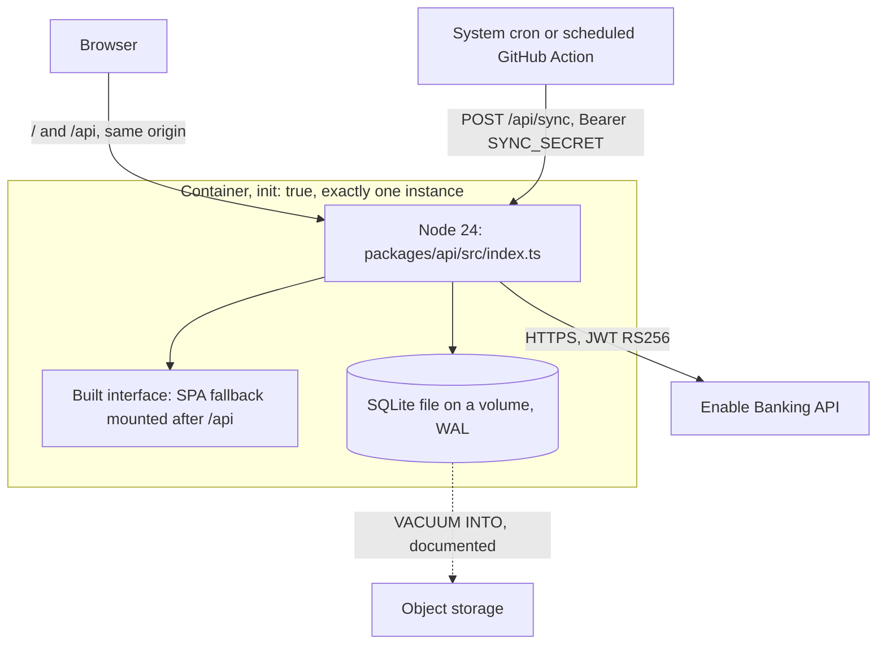

# Architecture Spine — Archant

## Design Paradigm

Modular monolith, ports and adapters. One Node process, three packages.

- **Domain** (`packages/api/src/domain/`): pure functions and types. Balance calculation, deduplication keys, transfer matching, cash flow classification, recurring detection, statement types. No Hono, no Drizzle, no `fetch`.
- **Services** (`packages/api/src/services/`): use cases. They open database transactions, call the domain and the connectors, and are the only code that touches the database.
- **Adapters in** (`packages/api/src/routes/`): Hono routes. They parse input with Zod, call one service function, and shape the envelope.
- **Adapters out** (`packages/api/src/connectors/`): file parsers and bank connectors behind the connector port. Pure except for the bank connectors' HTTP calls.
- **Interface** (`packages/web/`): a single-page app that talks to the API only through the typed client.
- **Data** (`packages/data/`): Drizzle schema, derived types, and isomorphic constants and helpers such as money and account types.

There is no household entity: one running instance is one household.

## Invariants & Rules



An arrow means "may import". The web package imports only `app.ts` for the `AppType` type and files under `schemas/`.

### AD-1 — Layers and dependency direction [ADOPTED]

- **Binds:** all
- **Prevents:** business logic tied to Hono or to the database, which cannot be tested without a server and cannot be reused by the sync route or a script.
- **Rule:** Follow the diagram above. A route calls exactly one service function. A domain function takes data and returns data. Only services import `db`. Work that must run after a commit, such as recurring detection, is called by the service, and its failure is logged without failing the request. Scripts live in `packages/api/src/cli/` and call services; `index.ts` stays the only server entrypoint. Oxlint `no-restricted-imports` overrides enforce it: `domain/**` may not import `drizzle-orm`, `hono`, `services/**` or `connectors/**`; `connectors/**` may not import `drizzle-orm` or `services/**`.

### AD-2 — The ledger is the single writer

- **Binds:** Epics 1, 2, 4, 5, 7, 8, 10; FR3, FR6, FR7, FR17, FR19, FR22–FR26, FR31–FR33, FR50–FR52
- **Prevents:** manual entry, file import, bank sync, bulk edit and transfer matching each writing money rows their own way.
- **Rule:** Only `services/ledger.ts` writes to `entries`, `transactions`, `entry_keys`, `balances`, `transfers` and `rejected_transfers`, and only it deletes an account. Other services call ledger functions. Every ledger function takes an `origin` (`user`, `rule`, `provider`, `sync`, `maintenance`) and runs in one database transaction opened with `behavior: "immediate"`, which recomputes the affected balances before committing. Foreign keys that point at `entries` or `transactions` are `ON DELETE RESTRICT`, so a bypass fails instead of cascading. An oxlint override allows importing those six tables only from `services/ledger.ts` and `domain/**` types.

### AD-3 — Connector port

- **Binds:** Epics 2, 10; FR12–FR19, FR48–FR56
- **Prevents:** a new bank or a new file format needing changes in the ledger, and file and bank imports diverging in shape.
- **Rule:** Every source produces a `ParsedStatement`, defined in `domain/statement.ts`:

  ```ts
  type NormalizedTransaction = {
  	externalId: string | null; // OFX FITID, Enable Banking entry_reference; never Enable Banking transaction_id
  	date: string; // YYYY-MM-DD, literal date part from the source (see Conventions)
  	amount: MinorUnits; // booked on the account, in the account currency, signed per AD-5
  	currency: string;
  	originalAmount: Money | null; // foreign amount of a card payment abroad, stored, never summed
  	label: string;
  	reference: string | null; // cheque or QIF N number
  	notes: string | null;
  	pending: boolean;
  };
  type ParsedStatement = {
  	transactions: NormalizedTransaction[];
  	balance: { amount: MinorUnits; currency: string; date: string } | null; // signed as the bank shows it, AD-5
  	rejected: { ref: string; reason: RejectionCode }[]; // ref is a line number or a provider id
  };
  ```

  A file parser implements `FileSource { id; detect(bytes, fileName); parse(bytes, options): ParsedStatement }`, where `options` carries the target account's currency and the CSV mapping when relevant. A bank connector implements `BankConnector { id; listInstitutions; startAuthorization; completeAuthorization; revokeAuthorization; listAccounts; fetchStatement(accountRef, since); consentExpiresAt }`. `listAccounts` returns a stable account identity that survives a consent renewal (Enable Banking `identification_hash`). Both kinds are registered in one static list, `connectors/registry.ts`, with no dynamic loading. A connector parses its raw input or provider response with Zod, and never touches the database.

### AD-4 — Ingestion pipeline

- **Binds:** Epics 1, 2, 5, 8, 9, 10; FR16, FR18, FR22, FR31, FR37, FR40, FR50
- **Prevents:** rules seeing transfers before matching in one path and after in another, balances computed before rules exclude a transaction, and preview and confirm writing different sets.
- **Rule:** `ledger.ingest(accountId, statement, { importId | connectionId | manual, dryRun })` runs per account, in one transaction, in this order:
  1. Reject lines dated before the account's opening anchor with `BEFORE_OPENING_DATE`.
  2. Key matching, with key lookups batched per statement (AD-7).
  3. Pending reconciliation (AD-17).
  4. Insert new entries, attach keys to matched ones.
  5. Rules (Epic 8; a no-op until then).
  6. Transfer matching (Epic 5; a no-op until then).
  7. Statement balance (AD-8).
  8. Balance recompute.

  With `dryRun`, it returns the preview grouped as to create, already present, matched to an existing entry, possible duplicates and rejected, then rolls back. A file preview stores the bytes and options in `imports` with status `previewed` and returns its id. Confirming takes that id, re-runs `ingest` without `dryRun`, and answers `409 IMPORT_PREVIEW_STALE` when the groups differ from the preview. Previewed imports older than 24 hours are purged at start. Manual creation goes through the same function with a one-line statement and no key.

### AD-5 — Sign convention

- **Binds:** all money paths; NFR1
- **Prevents:** half the code treating a purchase as positive, as Sure does, and the other half as negative; and a card balance of `-500` raising net worth.
- **Rule:** An entry amount is signed from the account's point of view: negative means money leaves the account, for assets and liabilities alike, which is how banks print statements. Stored balances are the value of an asset and the amount owed on a liability, so an asset's day balance is `previous + sum(amounts)` and a liability's is `previous - sum(amounts)`. Net worth is `sum(assets) - sum(liabilities)`. A statement balance arrives signed as the bank shows it; one ledger function, `toStoredBalance(account, signedBalance)`, converts it. No connector negates a balance.

### AD-6 — Money, currency and account types

- **Binds:** all; FR1, FR2, FR9–FR11, NFR1, NFR2
- **Prevents:** floats, two parsers of `1 234,56` disagreeing, the API and a browser disagreeing on a currency's decimals, and two lists of account types.
- **Rule:** Money is `{ amount: MinorUnits; currency: string }`, where `MinorUnits` is a branded integer. `packages/data/money.ts` owns it, with `parseAmount(text, locale)`, `formatMoney(money, locale)` built on `Intl.NumberFormat`, and a static ISO 4217 minor-unit table. An entry's currency always equals its account's; the ledger refuses anything else. Totals use `settings.reporting_currency` (default `EUR`), read through one helper, and skip, and report, accounts in any other currency. `packages/data/account-types.ts` exports `ACCOUNT_TYPES`: each type with its classification (`asset` or `liability`) and allowed subtypes. Type-specific attributes such as a loan's rate live in `accounts.details`, a JSON column validated by a Zod schema per type.

### AD-7 — Deduplication keys

- **Binds:** Epics 2, 10; FR17, FR18, FR23, FR51, FR52
- **Prevents:** a key recomputed after an edit, a re-export with new `FITID`s duplicating a file, file and bank sync producing two rows for one operation, and a revert deleting what another source confirmed.
- **Rule:** Keys live in `entry_keys (entry_id, account_id, source, key, import_id, connection_id)`, unique on `(account_id, source, key)`. Manual entries have no key. Every other source writes `fp:<sha256 of date|amount|normalised label|occurrence index within the statement>`, plus `ext:<externalId>` when present. Keys are written at ingest and never recomputed. An exact match on either key means "already present". Remaining lines are matched as one assignment per statement: sort lines and candidates by amount then date, and pair each line with the candidate of the same amount at the nearest date within 3 days. Candidates are entries of the account, committed before this ingest, carrying no key from this source. A line with no candidate is created; a line with a tie is created and flagged `possible_duplicate`. Reverting an import deletes the keys it wrote, then deletes an entry only if no key from another source remains, and never deletes a valuation it did not create. Label normalisation lives in `domain/normalize-label.ts` and serves fingerprints, merchants and recurring detection.

### AD-8 — Entries, valuations and balances

- **Binds:** Epics 1, 2, 6, 7, 10; FR1, FR6–FR11, FR19, FR34, FR54, FR56
- **Prevents:** two ways of storing an opening balance, history jumping when a bank is linked or disconnected, and two readers inventing "current balance" differently.
- **Rule:** As in Sure's delegated types, `entries` holds every dated amount with `kind` `transaction` or `valuation`; transaction-only columns sit in `transactions`, keyed by `entry_id`. A valuation has a `valuation_kind` among `opening_anchor`, `reconciliation` and `current_anchor`, and its amount is the stored balance of AD-5, never a delta. An account gets exactly one `opening_anchor`, created with it. An account with `bank_account_id` set, which reaches its connection through `bank_accounts.bank_connection_id`, is computed backward from its `current_anchor`; any other account forward from its `opening_anchor`. A `reconciliation` sets the end-of-day balance on its date in both directions, as in Sure's `Balance::ForwardCalculator` and `Balance::ReverseCalculator`. A file statement balance becomes a `reconciliation` carrying `import_id`, unless the user entered one on that date, in which case the user's value stays and the preview shows the gap. A bank sync rewrites the `current_anchor`. On disconnect, the ledger turns the last `current_anchor` into a `reconciliation` and clears `bank_account_id` in one transaction. `balances` holds one row per day up to `max(today, latest entry date)`; every reader calls `balanceOn(accountId, date)`, which returns the last row on or before the date. Pending transactions count in balances.

### AD-9 — Cash flow classification is defined once

- **Binds:** Epics 5, 6, 7, 9; FR21, FR25, FR33, FR35
- **Prevents:** the dashboard, the category drill-down and the direction filter disagreeing on what counts as spending, and a loan payment cancelling itself out.
- **Rule:** `domain/cash-flow.ts` exports `countsInCashFlow(tx)` and `direction(tx)`, returning `income`, `expense` or `transfer`. A transaction does not count when it is excluded, pending, on an account excluded from reports, or part of a transfer, with one exception: the outflow side of a `loan_payment` or `investment_contribution` counts, as an expense. Direction comes from the amount's sign for counted transactions and is `transfer` for the others that belong to a transfer. A category total is the signed sum of its counted transactions; the category's kind only groups the display. The transaction list's direction filter and every report query use these two functions, through one query builder in `services/reports.ts`.

### AD-10 — Manual edits win

- **Binds:** Epics 4, 8, 10; FR23, FR38, FR39, FR51
- **Prevents:** a rule, a categorisation provider or a booked version overwriting what the user set, and locking depending on who called the ledger.
- **Rule:** `transactions.locked_fields` is a JSON array of field names. Only a ledger call with `origin: "user"` adds to it. Calls with any other origin never write a locked field. Category and merchant merges use `maintenance` and keep lock state. `transactions.category_origin` records who set the category (`user`, `rule`, `provider` or null), so a provider can skip categories set by rules.

### AD-11 — Transfers

- **Binds:** Epics 5, 7; FR31–FR33
- **Prevents:** a transfer stored as a flag on one side, two matchers with different windows, and results depending on the order accounts are synced.
- **Rule:** As in Sure, `transfers (id, outflow_transaction_id, inflow_transaction_id, kind)`, each transaction in at most one transfer, and `rejected_transfers` for refused pairs. The kind derives from the inflow account type: credit card gives `credit_card_payment`, loan gives `loan_payment`, investment gives `investment_contribution` unless the outflow is also an investment account, which gives `internal_move` as Sure's `Transfer::Creator` does, anything else `internal_move`. `domain/transfer-matching.ts` finds candidates: opposite amount, different account, same currency, dates within 4 days, neither side matched, neither side excluded, both accounts active, pair not rejected. Automatic matching requires mutual uniqueness: the transaction has one candidate, and that candidate has one candidate. Deleting a side, or editing its amount, account or currency, deletes the transfer in the same transaction.

### AD-12 — Reference data seeded once

- **Binds:** Epics 3, 4, 6; FR27, FR42
- **Prevents:** default categories coming back after the user deleted them, and two concurrent requests seeding twice.
- **Rule:** `settings` is a key-value table. `services/seed.ts` runs at server start and seeds defaults only if it can insert the `defaults_seeded_at` row, in the same transaction. Default category names are French strings stored as data.

### AD-13 — Authentication and authorisation

- **Binds:** Epics 3, 10; FR42–FR45, NFR6
- **Prevents:** a hand-rolled session check, the setup route staying open, a user promoting themselves, and the cron being refused by the session guard.
- **Rule:** Better Auth with its Drizzle adapter (`usePlural: true`), email and password, public sign-up disabled, and its `admin` plugin. Its credentials table is renamed `auth_accounts` so it never collides with the domain's `accounts`. Its schema is generated once with the `auth` CLI into `packages/data/schema/auth.ts`, then maintained by hand; `role` is declared with `input: false` and carries a check constraint from `USER_ROLES` in `@archant/data`. `/api/setup` first claims the `setup_completed_at` settings row atomically, then creates the user with `auth.api.createUser`; if the claim fails it answers `403`. One middleware guards every `/api` route except `/api/health`, `/api/auth/*`, `/api/setup` and `/api/sync`. `/api/sync` accepts only `Authorization: Bearer <SYNC_SECRET>`, compared in constant time. The interface's sync button calls `POST /api/bank-connections/:id/sync` with the session; both call the same `services/sync.ts` function. Mutating routes use Hono's `csrf()` middleware. Authorisation reads `role` through one helper, `requireRole`. `/api/auth/*` is Better Auth's own handler, outside the envelope and outside `AppType`.

### AD-14 — Secrets and logs

- **Binds:** Epic 10, all logging; NFR4, NFR5
- **Prevents:** a token stored in clear by one connector, and an IBAN or amount logged through a nested object.
- **Rule:** Enable Banking session ids and any provider token are encrypted with AES-256-GCM through `services/crypto.ts`, key from `ENCRYPTION_KEY` (32 bytes, base64), stored as `v1:<iv>:<tag>:<ciphertext>`. Losing the key means reconnecting the banks, nothing else. An IBAN is stored masked, last four characters only. Logs go through one pino instance and carry only ids, counts, durations and error codes: never a statement, a transaction, a provider response or a raw error from a provider. Connectors throw sanitised `AppError`s. `redact` covers full header paths (`req.headers.authorization`, `req.headers.cookie`). A test serialises representative errors and log lines and fails on an amount or an IBAN pattern.

### AD-15 — API shape

- **Binds:** all routes; NFR7
- **Prevents:** two list endpoints paginating differently, forms unable to show a field error, and the interface losing its types.
- **Rule:** Every route lives under `/api`, returns `{ data }` or `{ error: { code, message, fields? } }`, where `fields` is `{ path, code }[]` for `VALIDATION_ERROR` only, built by one Zod-error mapper. Routes are mounted by chaining in `packages/api/src/app.ts`, which exports `AppType`; handlers are `async`, return errors with `c.json(..., status)` rather than `c.notFound()`, and the web package pins the same Hono version. Lists take `page` (from 1) and `pageSize` (default 50, max 200), return `{ items, page, pageSize, total }`, and order by `date DESC, created_at DESC, id DESC`. Bulk actions accept `ids` or the list's filter object. Import uploads are `multipart/form-data` with a 5 MB `bodyLimit`. Request schemas live in `packages/api/src/schemas/` and import only `zod` and `@archant/data`. Error codes are a closed union in `packages/api/src/lib/errors.ts`; the interface translates `errors.<CODE>`.

### AD-16 — Tests never reach the network

- **Binds:** all; NFR11
- **Prevents:** a test calling Enable Banking, an app swallowing msw's refusal, and branch coverage of money paths left to goodwill.
- **Rule:** A Vitest setup file starts msw with `onUnhandledRequest` collecting unhandled requests and failing the test in `afterEach`, naming the URL. Provider tests use recorded, anonymised fixtures; file parsers use committed anonymised files from at least three French banks. Database tests use a migrated temporary SQLite file per test file. Coverage thresholds are 100% of branches on `domain/**`, `services/ledger.ts` and `connectors/**`. Playwright runs with `forbidOnly` in CI and without reusing a running server; end-to-end tests point `ENABLE_BANKING_API_URL` at a local fake server.

### AD-17 — Entry identity is stable

- **Binds:** Epics 2, 4, 5, 9, 10; FR51, FR52
- **Prevents:** a pending-to-booked replacement or a duplicate merge changing an entry's id and orphaning its tags, transfer, recurring link and keys.
- **Rule:** An entry's id never changes. `ledger.absorb(survivorId, source)` updates the survivor in place, skipping locked fields, moves every key, tagging, transfer and recurring link onto it, and deletes the absorbed row. Pending reconciliation, step 3 of AD-4, uses it: an exact key match on a pending entry absorbs the booked line, amount changes included; otherwise a booked line absorbs a pending entry of the same account and connection with the same amount within 5 days. A booked line is looked up by its fingerprint, then its `ext:` key; a pending line by its `ext:` key only, since its fingerprint's occurrence index shifts once an identical line before it is booked. A pending line no key found is recognised within its group of identical pending lines (same date, amount and normalised label): the group's lines, in statement order, take the last of the connection's unclaimed pending entries holding a fingerprint of that group, ordered by the lowest index they hold, then age, then id. Indices are searched up to 100 (`MAX_IDENTICAL_LINES`). A line with an `ext:` key never takes a candidate holding one, since its reference would have found it; a line without one takes any candidate. A pending entry absent from syncs on two different days, in `APP_TIMEZONE`, is deleted; a line the sync refused still vouches for the entry its key names (`transactions.pending_missed_syncs` and `transactions.pending_missed_on`, beside `transactions.pending`: AD-8 keeps transaction-only columns on `transactions`). The user's "merge possible duplicate" action uses `absorb` too.

### AD-18 — Enable Banking specifics

- **Binds:** Epic 10; FR48–FR56
- **Prevents:** the connector keying on an unstable id, double-counting pending amounts, and exceeding the bank's daily call quota.
- **Rule:** `externalId` is `entry_reference`, never `transaction_id`; without it the fingerprint key applies. The sign comes from `credit_debit_indicator` (`DBIT` negative). Status `PDNG` is pending; `BOOK` is booked; any other status is dropped. The date is `booking_date`, else `value_date`, else `transaction_date`. The current anchor is the first available of `ITBD`, then `CLBD`: a booked balance, with pending entries applied on top. A sync fetches from the last successful sync minus 7 days; a bank refusing that period with `WRONG_TRANSACTIONS_PERIOD` is asked again for 89, then 60, then 30 days, and only pending entries dated from the accepted start can count a miss. A line listed twice with the same content is kept once, the booked copy first. A pending line whose booked version the same response lists, under the same `entry_reference` or the same Sure `compute_external_id` (`transaction_id`, else `entry_reference`, else the content), is dropped, as Sure's importer does. The lines are read first and the balance apart, after a complete read: a balance failure keeps the anchor, still ingests the lines, and leaves `BANK_BALANCE_UNAVAILABLE` as the connection's last error; a provider failure after the first page ingests the pages read, counts no pending miss and fails the account without moving its window. The consent asked for is the bank's maximum capped at 90 days, less 60 seconds. A connection holds a lease (`bank_connections.sync_started_at`, expiring after 10 minutes): a concurrent sync answers `409 SYNC_IN_PROGRESS`. Two syncs of one connection are at least one hour apart, except right after a consent renewal. The interface warns when the last successful sync is older than 48 hours. The JWT is signed RS256 with `jose`, from a key loaded through `crypto.createPrivateKey` so PKCS#1 and PKCS#8 both work.

## Consistency Conventions

| Concern | Convention |
| --- | --- |
| Identifiers | Text UUID v4 from `crypto.randomUUID()`. |
| Dates | Calendar dates are `YYYY-MM-DD` text. Timestamps are integer epoch milliseconds, UTC. A date from a provider is its literal date part, never converted through a time zone, extracted by `domain/provider-date.ts`. "Today" is computed with `Intl.DateTimeFormat` in `APP_TIMEZONE`, default `Europe/Paris`. |
| Database | Plural snake_case tables, snake_case columns mapped to camelCase. Enumerations are `text` columns with a check constraint, built from a `const` array in `@archant/data` that is also the TypeScript union. The client sets `PRAGMA foreign_keys = ON`, `journal_mode = WAL` and a `busy_timeout` once, where it is created. |
| Package exports | `@archant/data` exposes subpaths through its `exports` map (`@archant/data/money`), never an index. |
| File naming | As in `AGENTS.md`: kebab-case files, PascalCase components, camelCase hooks, co-located `*.spec.ts(x)`, no barrels. |
| Connector ids | kebab-case: `ofx`, `csv`, `qif`, `enable-banking`. The same string is `entry_keys.source` and `imports.source`. |
| File decoding | Bytes are decoded with `TextDecoder` in strict UTF-8, falling back to `windows-1252`; OFX honours its `CHARSET` header. Parsers receive strings. |
| Errors | Services throw `AppError(code, message)`. Rejected lines carry a `RejectionCode`, not free text. |
| Configuration | `validateEnv(runtimeEnv)` in `packages/api/src/env.ts`. Variables, all in `.env.example`: `DATABASE_URL`, `DATABASE_AUTH_TOKEN`, `BETTER_AUTH_SECRET`, `BETTER_AUTH_URL`, `TRUSTED_PROXIES`, `ENCRYPTION_KEY`, `SYNC_SECRET`, `APP_TIMEZONE`, `LOG_LEVEL`, `ENABLE_BANKING_APPLICATION_ID`, `ENABLE_BANKING_PRIVATE_KEY`, `ENABLE_BANKING_API_URL`. A connector missing its variables is listed as unavailable; the app still starts. |
| Toolchain | `_bmad-output/implementation-artifacts/scaffolding-lessons.md` is binding: `.ts` import extensions, recursive `**/*.ts` includes, `onlyBuiltDependencies: [esbuild]`, `file:../../local.db` locally, migrations through `drizzle-orm/libsql/migrator`. `skipLibCheck: true`, since Drizzle and Better Auth ship type errors in their own declarations. |
| Interface to API | The client calls the relative base `/api`. In development, Vite proxies `/api` to port 8787, so there is no CORS and no build-time API URL. |
| Interface state | Server state only through TanStack Query, keys from one `queryKeys` object per resource. List filters live in URL search params validated by TanStack Router. |
| Interface text | i18next, French as the only locale, keys by page (`accounts.form.name`). No literal visible string in a component. |
| Components | shadcn/ui copied into `packages/web/src/components/ui/`, domain components in `components/`. Money is rendered by one `<Money>` component calling `formatMoney`. Visual decisions come from `DESIGN.md` and `EXPERIENCE.md` produced by `bmad-ux`. |

## Stack

Versions verified on npm on 2026-09-21. Packages already listed in `docs/tech-stack.md` keep their row there.

| Name | Version |
| --- | --- |
| Node.js | 24.21 |
| @hono/node-server | 2.1.1 |
| better-auth (with `admin` plugin, `auth` CLI) | 1.7.5 |
| papaparse, @types/papaparse | 5.7.0 |
| ofx-js | 1.1.1 |
| jose | 6.2.12 |
| pino | 10.3.1 |
| msw | 2.15.0 |
| tailwindcss, @tailwindcss/vite | 4.3.3 |
| @vitejs/plugin-react | 6.1.1 |
| shadcn (CLI) | 4.21.0 |
| lucide-react | 1.47.0 |
| recharts (with `react-is`) | 3.10.1 |
| @tanstack/react-table | 9.2.4 |
| @tanstack/router-plugin | 1.168.40 |
| react-hook-form | 7.88.0 |
| @hookform/resolvers | 5.9.1 |
| i18next | 26.4.2 |
| react-i18next | 17.0.14 |

`ofx-js` is wrapped: files over 5 MB are refused before parsing, because its SGML conversion slows down exponentially on long tag names, and a pre-pass closes empty leaf tags such as `<MEMO>`, which otherwise make it reject the whole file. Its string output is parsed by Zod, and `TRNAMT` accepts a decimal comma. The QIF parser is written in the repository: no maintained package exists. Money uses no library: amounts are integers and `Intl.NumberFormat` formats them. Date arithmetic on `YYYY-MM-DD` strings uses small helpers in `domain/`, not a date library.

## Structural Seed





Exactly one instance runs against a database. Unknown `/api/*` routes answer the `NOT_FOUND` JSON before the SPA fallback. A sync runs inside its request; a proxy or scheduler timeout that cuts it leaves every finished account committed and the others untouched. In development, Vite serves the interface on port 5173 and proxies `/api` to the API on 8787. Turso replaces the file through `DATABASE_URL` and `DATABASE_AUTH_TOKEN` with no code change; NFR10's timings are measured on a local file.

```text
packages/
  data/
    schema/            # Drizzle tables, one file per aggregate; auth.ts from the auth CLI, then hand-maintained
    drizzle/           # generated migrations
    money.ts           # MinorUnits, parseAmount, formatMoney, ISO 4217 table
    account-types.ts   # ACCOUNT_TYPES, classification, subtypes, details schemas
    types.ts           # InferSelectModel / InferInsertModel
  api/src/
    index.ts           # the only server entrypoint: env, migrations, seed, serve
    app.ts             # chained route mounts, exports AppType
    env.ts
    cli/               # reset-password and other scripts
    routes/            # Hono adapters, one file per resource; middleware/
    schemas/           # request schemas shared with the interface
    services/          # ledger.ts, imports.ts, sync.ts, reports.ts, seed.ts, setup.ts, crypto.ts
    domain/            # balances/, keys, transfer-matching, cash-flow, recurring, statement, provider-date
    connectors/        # registry.ts, ofx/, csv/, qif/, enable-banking/
    lib/errors.ts
  web/src/
    routes/            # TanStack Router file routes
    components/ui/     # shadcn/ui
    components/
    lib/api.ts         # hc<AppType>("/api")
    locales/fr.json
```

## Capability → Architecture Map

| Area | Lives in | Governed by |
| --- | --- | --- |
| Accounts, balances, snapshots (Epics 1, 7) | `services/ledger.ts`, `domain/balances/`, `data/account-types.ts` | AD-2, AD-5, AD-6, AD-8 |
| File import (Epic 2) | `connectors/{ofx,csv,qif}/`, `services/imports.ts` | AD-3, AD-4, AD-7, AD-17 |
| Access and deployment (Epic 3) | `routes/middleware/auth.ts`, `services/setup.ts`, `cli/`, `index.ts`, `Dockerfile` | AD-12, AD-13, AD-15 |
| Classification (Epic 4) | `services/classification.ts`, through the ledger | AD-2, AD-10, AD-12 |
| Transfers (Epic 5) | `domain/transfer-matching.ts`, ledger | AD-4, AD-9, AD-11 |
| Dashboard (Epic 6) | `services/reports.ts`, `domain/cash-flow.ts` | AD-6, AD-8, AD-9 |
| Rules (Epic 8) | `domain/rules/`, step 5 of the pipeline | AD-4, AD-10 |
| Recurring (Epic 9) | `domain/recurring.ts`, after commit | AD-1, AD-4, AD-17 |
| Enable Banking (Epic 10) | `connectors/enable-banking/`, `services/sync.ts` | AD-3, AD-7, AD-8, AD-13, AD-14, AD-17, AD-18 |

## Deferred

- **Rules data model.** Follows Sure's, as Epic 8 describes; its tables are settled by Story 8.1. Fixed now: rules run at step 5 of AD-4, write with `origin: "rule"`, and respect AD-10. A "mark as transfer" action may only set an expectation that the step-6 matcher reads; it never creates a transfer itself.
- **Currency conversion.** No exchange rates until a non-euro account exists; AD-6 keeps the door open.
- **Roles beyond `admin`, and invitations.** `requireRole` and the `admin` plugin exist; a `viewer` role needs new checks only.
- **Full-text search.** `LIKE` on label and notes until Story 1.5's 300 ms target fails. SQLite FTS5 then arrives through one migration and one query helper in `services/`, the only place raw SQL is then allowed.
- **Accessibility (NFR13).** Settled in `DESIGN.md` and `EXPERIENCE.md` by `bmad-ux`.
- **Backups.** Documented in `docs/deployment.md` with `VACUUM INTO`, not run by the application.
- **Monitoring and metrics.** Pino JSON on stdout only.
- **Other deployment targets.** Configuration and documentation only, per ADR 0002.
