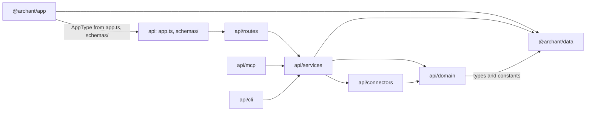
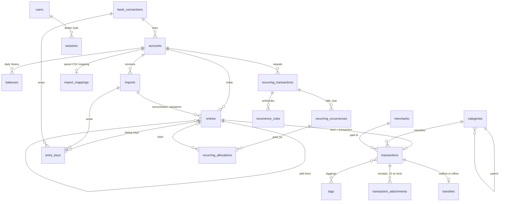
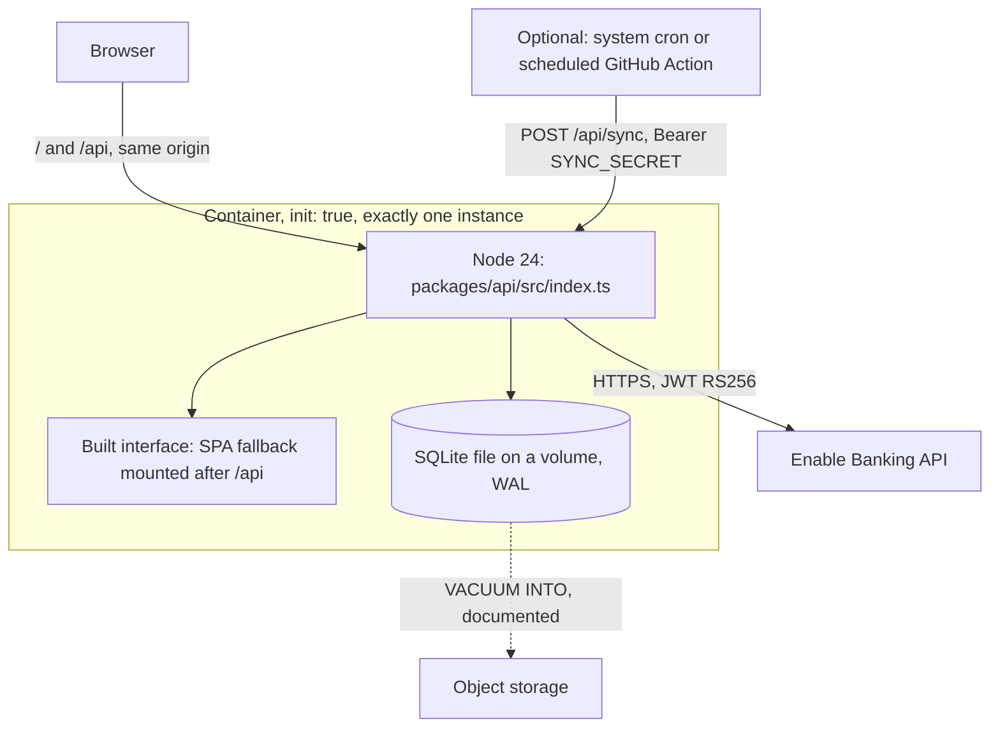

# Architecture Spine — Archant

## Design Paradigm

Modular monolith, ports and adapters. One Node process, three packages.

- **Domain** (`packages/api/src/domain/`): pure functions and types. Balance calculation, deduplication keys, transfer matching, cash flow classification, recurring detection, statement types. No Hono, no Drizzle, no `fetch`.
- **Services** (`packages/api/src/services/`): use cases. They open database transactions, call the domain and the connectors, and are the only code that touches the database.
- **Adapters in** (`packages/api/src/routes/`, `packages/api/src/mcp/`): Hono routes and MCP tools. They parse input with Zod, call one service function, and shape the envelope or the tool result.
- **Adapters out** (`packages/api/src/connectors/`): file parsers and bank connectors behind the connector port. Pure except for the bank connectors' HTTP calls.
- **Interface** (`packages/app/`): a single-page app that talks to the API only through the typed client.
- **Data** (`packages/data/`): Drizzle schema, derived types, and isomorphic constants and helpers such as money and account types.

There is no household entity: one running instance is one household.

## Invariants & Rules



An arrow means "may import". The app package imports only `app.ts` for the `AppType` type and files under `schemas/`.

### AD-1 — Layers and dependency direction [ADOPTED]

- **Binds:** all
- **Prevents:** business logic tied to Hono or to the database, which cannot be tested without a server and cannot be reused by the sync route or a script.
- **Rule:** Follow the diagram above. A route calls exactly one service function. A domain function takes data and returns data. Only services import `db`. Work that must run after a commit, such as recurring detection, is called by the service, and its failure is logged without failing the request. Scripts live in `packages/api/src/cli/` and call services; `index.ts` stays the only server entrypoint. Oxlint `no-restricted-imports` overrides enforce it: `domain/**` may not import `drizzle-orm`, `hono`, `services/**` or `connectors/**`; `connectors/**` may not import `drizzle-orm` or `services/**`.

### AD-2 — The ledger is the single writer

- **Binds:** Epics 1, 2, 4, 5, 7, 8, 10; FR3, FR6, FR7, FR17, FR19, FR22–FR26, FR31–FR33, FR50–FR52
- **Prevents:** manual entry, file import, bank sync, bulk edit and transfer matching each writing money rows their own way.
- **Rule:** Only the modules of `services/ledger/` write to `entries`, `transactions`, `trades`, `entry_keys`, `balances`, `holdings`, `cost_basis_locks`, `transfers`, `rejected_transfers`, `taggings` and `transaction_attachments`, and only they delete an account; every ledger delete removes a transaction's taggings and attachments before the row. `transaction_attachments` is the ledger's because an upload checks the count and the transaction's existence in the immediate transaction that inserts, which reads `transactions`, and every ledger delete removes them first; `services/attachments.ts` keeps reading the type and cleaning the name. Other services call ledger functions. Every ledger function takes an `origin` (`user`, `rule`, `provider`, `sync`, `maintenance`) and runs in one database transaction opened with `behavior: "immediate"`, which recomputes the affected balances before committing. Foreign keys that point at `entries` or `transactions` are `ON DELETE RESTRICT`, so a bypass fails instead of cascading; the recurring payments, price changes and rejections of AD-24, which carry no money of their own, are the exception it names. An oxlint override allows importing those tables only from `services/ledger/**`, `domain/**` types, and the test code that seeds rows directly (`testing/ledger.ts`, `services/history-volume.spec.ts`).

### AD-3 — Connector port

- **Binds:** Epics 2, 10; FR12–FR19, FR48–FR56
- **Prevents:** a new bank or a new file format needing changes in the ledger, and file and bank imports diverging in shape.
- **Rule:** Every source produces a `ParsedStatement`, defined in `domain/statement.ts`:

  ```ts
  type NormalizedTransaction = {
  	externalId: string | null; // OFX FITID, Enable Banking entry_reference; never Enable Banking transaction_id
  	date: string; // YYYY-MM-DD, literal date part from the source (see Conventions)
  	amount: MinorUnits; // booked on the account, in the account currency, signed per AD-5
  	currency: string;
  	originalAmount: Money | null; // foreign amount of a card payment abroad, stored, never summed
  	label: string;
  	reference: string | null; // cheque or QIF N number
  	notes: string | null;
  	pending: boolean;
  };
  type ParsedStatement = {
  	transactions: NormalizedTransaction[];
  	balance: { amount: MinorUnits; currency: string; date: string } | null; // signed as the bank shows it, AD-5
  	rejected: { ref: string; reason: RejectionCode }[]; // ref is a line number or a provider id
  };
  ```

  A file parser implements `FileSource { id; detect(bytes, fileName); parse(bytes, options): ParsedStatement }`, where `options` carries the target account's currency and the CSV mapping when relevant. A bank connector implements `BankConnector { id; describeApplication; listInstitutions; startAuthorization; completeAuthorization; revokeAuthorization; listAccounts; fetchStatement(accountRef, since); consentExpiresAt }`. `listAccounts` returns a stable account identity that survives a consent renewal (Enable Banking `identification_hash`). Both kinds are registered in one static list, `connectors/registry.ts`, with no dynamic loading. A connector parses its raw input or provider response with Zod, and never touches the database.

### AD-4 — Ingestion pipeline

- **Binds:** Epics 1, 2, 5, 8, 9, 10; FR16, FR18, FR22, FR31, FR37, FR40, FR50
- **Prevents:** rules seeing transfers before matching in one path and after in another, balances computed before rules exclude a transaction, and preview and confirm writing different sets.
- **Rule:** `ingest(accountId, statement, { importId | connectionId | manual, dryRun })`, in `services/ledger/ingest.ts`, runs per account, in one transaction, in this order:
  1. Reject lines dated before the account's opening anchor with `BEFORE_OPENING_DATE`.
  2. Key matching, with key lookups batched per statement (AD-7).
  3. Pending reconciliation (AD-17).
  4. Insert new entries, attach keys to matched ones.
  5. Rules (Epic 8; a no-op until then).
  6. Transfer matching (Epic 5; a no-op until then).
  7. Statement balance (AD-8).
  8. Balance recompute.

  With `dryRun`, it returns the preview grouped as to create, already present, matched to an existing entry, possible duplicates and rejected, then rolls back. A file preview stores the bytes and options in `imports` with status `previewed` and returns its id. Confirming takes that id, re-runs `ingest` without `dryRun`, and answers `409 IMPORT_PREVIEW_STALE` when the groups differ from the preview. Previewed imports older than 24 hours are purged at start. Manual creation goes through the same function with a one-line statement and no key.

### AD-5 — Sign convention

- **Binds:** all money paths; NFR1
- **Prevents:** half the code treating a purchase as positive, as Sure does, and the other half as negative; and a card balance of `-500` raising net worth.
- **Rule:** An entry amount is signed from the account's point of view: negative means money leaves the account, for assets and liabilities alike, which is how banks print statements. Stored balances are the value of an asset and the amount owed on a liability, so an asset's day balance is `previous + sum(amounts)` and a liability's is `previous - sum(amounts)`. Net worth is `sum(assets) - sum(liabilities)`. A statement balance arrives signed as the bank shows it; one ledger function, `toStoredBalance(account, signedBalance)`, converts it. No connector negates a balance.

### AD-6 — Money, currency and account types

- **Binds:** all; FR1, FR2, FR9–FR11, NFR1, NFR2
- **Prevents:** floats, two parsers of `1 234,56` disagreeing, the API and a browser disagreeing on a currency's decimals, and two lists of account types.
- **Rule:** Money is `{ amount: MinorUnits; currency: string }`, where `MinorUnits` is a branded integer. `packages/data/money.ts` owns it, with `parseAmount(text, locale)`, `formatMoney(money, locale)` built on `Intl.NumberFormat`, and a static ISO 4217 minor-unit table. An entry's currency always equals its account's; the ledger refuses anything else. Totals use `settings.reporting_currency` (default `EUR`), read through one helper, and skip, and report, accounts in any other currency. `packages/data/account-types.ts` exports `ACCOUNT_TYPES`: each type with its classification (`asset` or `liability`) and allowed subtypes. Type-specific attributes such as a loan's terms live in `accounts.details`, a JSON column validated by a Zod schema per type; a loan's rates are integers in millionths (AD-25).

### AD-7 — Deduplication keys

- **Binds:** Epics 2, 10; FR17, FR18, FR23, FR51, FR52
- **Prevents:** a key recomputed after an edit, a re-export with new `FITID`s duplicating a file, file and bank sync producing two rows for one operation, and a revert deleting what another source confirmed.
- **Rule:** Keys live in `entry_keys (entry_id, account_id, source, key, import_id, connection_id)`, unique on `(account_id, source, key)`. Manual entries have no key, but for the one an assistant's `create_transaction` gives a line with its own id, as Sure's `external_id`: `ext:<source>:<externalId>` under the source `assistant`, which no import or sync reads, so that a retry finds the line instead of recording it twice. Every other source writes `fp:<sha256 of date|amount|normalised label|occurrence index within the statement>`, plus `ext:<externalId>` when present. Keys are written at ingest and never recomputed. An exact match on either key means "already present". Remaining lines are matched as one assignment per statement: sort lines and candidates by amount then date, and pair each line with the candidate of the same amount at the nearest date within 3 days. Candidates are entries of the account, committed before this ingest, carrying no key from this source. A line with no candidate is created; a line with a tie is created and flagged `possible_duplicate`. Reverting an import deletes the keys it wrote, then deletes an entry only if no key from another source remains, and never deletes a valuation it did not create. When the user deletes an entry, one by one or in bulk, every key it holds goes with it and nothing records the deletion, as in Sure, whose importer finds or creates by `external_id`: the next sync whose window still covers the line, or the next import of a file holding it, brings it back as a new line, paired like any other with an entry of the same amount nearby. Deleting is not hiding; excluding a transaction keeps it out of reports and keeps its keys. Label normalisation lives in `domain/normalize-label.ts` and serves fingerprints, merchants and recurring detection.

### AD-8 — Entries, valuations and balances

- **Binds:** Epics 1, 2, 6, 7, 10; FR1, FR6–FR11, FR19, FR34, FR54, FR56
- **Prevents:** two ways of storing an opening balance, history jumping when a bank is linked or disconnected, and two readers inventing "current balance" differently.
- **Rule:** As in Sure's delegated types, `entries` holds every dated amount with `kind` `transaction` or `valuation`; transaction-only columns sit in `transactions`, keyed by `entry_id`, and a valuation's notes in `entries.notes`, beside its `valuation_kind`, as Sure keeps them on `Entry`. A valuation has a `valuation_kind` among `opening_anchor`, `reconciliation` and `current_anchor`, and its amount is the stored balance of AD-5, never a delta. An account gets exactly one `opening_anchor`, created with it. An account with `bank_account_id` set, which reaches its connection through `bank_accounts.bank_connection_id`, is computed backward from its `current_anchor`; any other account forward from its `opening_anchor`. A `reconciliation` sets the end-of-day balance on its date in both directions, as in Sure's `Balance::ForwardCalculator` and `Balance::ReverseCalculator`. A file statement balance becomes a `reconciliation` carrying `import_id`, unless the user entered one on that date, in which case the user's value stays and the preview shows the gap. A bank sync writes its balance as the `current_anchor`; the anchor it supersedes, dated an earlier day, becomes a `reconciliation` on that day keeping its id, as Sure's `Account::CurrentBalanceManager`, so the bank figures form a chain and a line the bank never sent moves only the days between the two figures around it. An anchor dated the new balance's day or later is updated in place, amount and date, with no reconciliation, as Sure's `update_current_anchor`. The superseded anchor is deleted instead when a `reconciliation` already holds its day, the user's or the file's value winning, or when it is dated on or before the opening date. Linking and relinking replace the `current_anchor` without keeping the old one. On disconnect, the ledger turns the last `current_anchor` into a `reconciliation` and clears `bank_account_id` in one transaction. `balances` holds one row per day up to `max(today, latest entry date)`, its `cash` beside its `balance`: the balance less an investment account's holdings (AD-22), the balance itself on any other account and on one computed backward. Every reader calls `balanceOn(accountId, date)`, which returns the last row on or before the date. Pending transactions count in no balance, as Sure's `Entry.excluding_pending`: a bank balance is a booked one, and a pending line moves balances only once booked.

### AD-9 — Cash flow classification is defined once

- **Binds:** Epics 5, 6, 7, 9; FR21, FR25, FR33, FR35
- **Prevents:** the dashboard, the budget, the assistant's income statement and the « Sans catégorie » drill-down disagreeing on which rows count, a loan payment cancelling itself out, and the « Sens » filter or a rule's type condition drifting from Sure's, which call a loan payment's or contribution's outflow a transfer while reports count it as an expense.
- **Rule:** `domain/cash-flow.ts` exports `countsInCashFlow(tx)`, which decides what every cash-flow report counts, and `direction(tx)`, which the transaction list's « Sens » filter and the rules' type condition read. A transaction counts, as Sure's `IncomeStatement`, when it is neither excluded nor pending and is no transfer side, except the outflow of a `loan_payment` or `investment_contribution`, which counts as an expense whatever its sign, as Sure's `classification_sql`. Any other counted row is income above zero and an expense otherwise. Only the accounts of Sure's `IncomeStatement#eligible_accounts` count: active, included in reports, in the reporting currency (AD-6), and not tax-advantaged, `TAX_ADVANTAGED_SUBTYPES` in `@archant/data/account-types.ts` leaving a PEA and an assurance-vie out, as Sure's `tax_advantaged_account_ids`; `cashFlowAccounts` in `services/reports.ts` gives them, beside `reportedAccounts`, which net worth keeps. No trade counts, a dividend or interest included, as Sure's `trades_subquery_sql`. `direction` follows Sure's `Transaction::Search#apply_type_filter` and `Rule::ConditionFilter::TransactionType`: every transfer side is `transfer`, a loan payment's outflow included, any other row income above zero and an expense otherwise; its SQL twin is `joinedTransferSide` in `services/ledger/filter.ts`, tied by a parity test. Recurring detection, matching and bills read `recurringDirection` instead, which keeps a loan payment's outflow an expense until Story 27.24 follows Sure's recurring transfers. The counted rows are summed per category and per sign in `cashFlowByCategory`, `cashFlowByMonth` and `cashFlowByDay` of `services/ledger/queries.ts`, then read through two views. The gross view, `grossCashFlow`, is Sure's `IncomeStatement::Totals`: each side by top-level category, a sub-category's rows rolled into its parent, so a category may sit on both sides and a refund is income in its category; « Sans catégorie » on each side; each side's sub-category lines, as Sure's `subcategory_totals`. The net view, `netCashFlow`, is Sure's `net_category_totals`, derived from the gross one: each top-level category's income plus its expense, « Sans catégorie » included, an income line when positive, an expense line when negative, dropped at zero. The dashboard reads the net view; the assistant's income statement, its periods and its monthly statistics read the gross view; a budget takes its spending from the net view and its income from the gross view, as Sure's `Budget#actual_spending` and `actual_income`, and nets each category and « Sans catégorie » for its envelopes, as Sure's `budget_category_actual_spending`. A category's kind is shown, never read by either view. The list's totals leave a tax-advantaged account's rows out of income and expenses, as Sure's `Transaction::Search#totals`. The dashboard's « Sans catégorie » line opens the uncategorised list without a direction, since its net holds both signs.

### AD-10 — Manual edits win

- **Binds:** Epics 4, 8, 10; FR23, FR38, FR39, FR51
- **Prevents:** a rule, a categorisation provider or a booked version overwriting what the user set, and locking depending on who called the ledger.
- **Rule:** `transactions.locked_fields` is a JSON array of field names. Only a ledger call with `origin: "user"` adds to it. Calls with any other origin never write a locked field. Category and merchant merges use `maintenance` and keep lock state. `transactions.category_origin` records who set the category (`user`, `rule`, `provider` or null), so a provider can skip categories set by rules.

### AD-11 — Transfers

- **Binds:** Epics 5, 7; FR31–FR33
- **Prevents:** a transfer stored as a flag on one side, a matcher that links without the owner's say, and results depending on the order accounts are synced.
- **Rule:** As in Sure, `transfers (id, outflow_transaction_id, inflow_transaction_id, kind, status)`, each transaction in at most one transfer, and `rejected_transfers` for refused pairs. The kind derives from the inflow account type: credit card gives `credit_card_payment`, loan gives `loan_payment`, investment gives `investment_contribution` unless the outflow is also an investment account, which gives `internal_move` as Sure's `Transfer::Creator` does, anything else `internal_move`. `status` is Sure's `pending` or `confirmed`, and a pending transfer counts exactly as a confirmed one everywhere: only the list reads it, to offer the proposal. `domain/transfer-matching.ts` finds candidates: opposite amount, different account, same currency, neither side matched, excluded or a split line, both accounts active. Matching, after every ingest and every application of rules to history, reads every unmatched transaction of the household, as Sure's `auto_match_transfers!`: candidates within 4 days, the pair never rejected, a rule's expected account narrowing each line's candidates; it ranks every pair by days apart, then outflow and inflow id, and takes each pair whose two sides are still free, as a `pending` transfer. Reading every candidate before writing keeps the result independent of line and sync order. A pair by hand, from the picker or an assistant, is `confirmed` at once, its sides at most 30 days apart, a rejected pair included, as Sure's `transfer_match_candidates(date_window: 30)`. Confirming changes the status only; rejecting deletes the transfer and records the pair; « Dissocier » records nothing, so the next matching may propose the pair again. Deleting a side, or editing its amount, account or currency, deletes the transfer in the same transaction.

### AD-12 — Reference data seeded once

- **Binds:** Epics 3, 4, 6; FR27, FR42
- **Prevents:** default categories coming back after the user deleted them, and two concurrent requests seeding twice.
- **Rule:** `settings` is a key-value table. `services/seed.ts` runs at server start and seeds defaults only if it can insert the `defaults_seeded_at` row, in the same transaction. `services/ledger/holdings.ts` claims `fee_cost_basis_recomputed_at` the same way at start, to recompute every investment account's holdings once. Default category names are French strings stored as data.

### AD-13 — Authentication and authorisation

- **Binds:** Epics 3, 10; FR42–FR45, NFR6
- **Prevents:** a hand-rolled session check, the setup route staying open, a user promoting themselves, and the cron being refused by the session guard.
- **Rule:** Better Auth with its Drizzle adapter (`usePlural: true`), email and password, public sign-up disabled, and its `admin` plugin. Its credentials table is renamed `auth_accounts` so it never collides with the domain's `accounts`. Its schema is generated once with the `auth` CLI into `packages/data/schema/auth.ts`, then maintained by hand; `role` is declared with `input: false` and carries a check constraint from `USER_ROLES` in `@archant/data`. `/api/setup` first claims the `setup_completed_at` settings row atomically, then creates the user with `auth.api.createUser`; if the claim fails it answers `403`. One middleware guards every `/api` route except `/api/health`, `/api/auth/*`, `/api/setup`, `/api/sync`, `/api/mcp`, which AD-19 guards with an OAuth token, and `/api/invitations/preview` and `/api/invitations/accept`, which take an invitation's token in their body; every other `/api/invitations` route calls `requireRole("admin")` itself, since `viewerReadOnly` lets a viewer's `GET` through and another method on either public path, such as `DELETE`, reaches `/:id` without a session. `/api/sync` accepts only `Authorization: Bearer <SYNC_SECRET>`, compared in constant time. The interface's sync button calls `POST /api/bank-connections/:id/sync` with the session; both call the same `services/sync.ts` function. Mutating routes use Hono's `csrf()` middleware. `requireSession` puts the signed-in user on the Hono context, and authorisation reads `role` through one helper, `requireRole`, in `routes/middleware/roles.ts` (AD-21). `/api/auth/*` is Better Auth's own handler, outside the envelope and outside `AppType`.

### AD-14 — Secrets and logs

- **Binds:** Epic 10, all logging; NFR4, NFR5
- **Prevents:** a token stored in clear by one connector, and an IBAN or amount logged through a nested object.
- **Rule:** Enable Banking session ids, the Enable Banking private key saved from the interface, and any provider token are encrypted with AES-256-GCM through `services/crypto.ts`, key from `ENCRYPTION_KEY` (32 bytes, base64), stored as `v1:<iv>:<tag>:<ciphertext>`. The private key lives in `settings` (`enable_banking_private_key`, PKCS#8 PEM, encrypted) beside `enable_banking_application_id` (plain: it names the key and signs nothing); `ENABLE_BANKING_APPLICATION_ID` and `ENABLE_BANKING_PRIVATE_KEY`, both or neither, win over them. The connector is resolved per request from whichever pair applies, never captured at boot or cached. Losing the key means saving the credentials again and reconnecting the banks, nothing else. An IBAN is stored masked, last four characters only. Logs go through one pino instance and carry only ids, counts, durations and error codes: never a statement, a transaction, a provider response or a raw error from a provider. Connectors throw sanitised `AppError`s. `redact` covers full header paths (`req.headers.authorization`, `req.headers.cookie`). A test serialises representative errors and log lines and fails on an amount or an IBAN pattern.

### AD-15 — API shape

- **Binds:** all routes; NFR7
- **Prevents:** two list endpoints paginating differently, forms unable to show a field error, and the interface losing its types.
- **Rule:** Every route lives under `/api`, returns `{ data }` or `{ error: { code, message, fields? } }`, where `fields` is `{ path, code }[]` for `VALIDATION_ERROR` only, built by one Zod-error mapper. Routes are mounted by chaining in `packages/api/src/app.ts`, which exports `AppType`; handlers are `async`, return errors with `c.json(..., status)` rather than `c.notFound()`, and the app package pins the same Hono version. Lists take `page` (from 1) and `pageSize` (default 50, max 200), return `{ items, page, pageSize, total }`, and order by `date DESC, created_at DESC, id DESC`. Bulk actions accept `ids` or the list's filter object. Import uploads are `multipart/form-data` with a 5 MB `bodyLimit`. Request schemas live in `packages/api/src/schemas/` and import only `zod` and `@archant/data`. Error codes are a closed union in `packages/api/src/lib/errors.ts`; the interface translates `errors.<CODE>`.

### AD-16 — Tests never reach the network

- **Binds:** all; NFR11
- **Prevents:** a test calling Enable Banking, an app swallowing msw's refusal, and branch coverage of money paths left to goodwill.
- **Rule:** A Vitest setup file starts msw with `onUnhandledRequest` collecting unhandled requests and failing the test in `afterEach`, naming the URL. Provider tests use recorded, anonymised fixtures; file parsers use committed anonymised files from at least three French banks. Database tests use a migrated temporary SQLite file per test file. Coverage thresholds are 100% of branches on `domain/**`, `services/ledger/**` and `connectors/**`, and on `@archant/data`'s `money.ts`, `micros.ts`, `months.ts` and `goals.ts`, whose transitions decide what a goal's menu offers and the server accepts. Playwright runs with `forbidOnly` in CI and without reusing a running server; end-to-end tests point `ENABLE_BANKING_API_URL` at a local fake server and `YAHOO_FINANCE_URL` at a closed loopback port.

### AD-17 — Entry identity is stable

- **Binds:** Epics 2, 4, 5, 9, 10; FR51, FR52
- **Prevents:** a pending-to-booked replacement or a duplicate merge changing an entry's id and orphaning its tags, transfer, recurring link and keys.
- **Rule:** An entry's id never changes. `absorb(survivorId, source)`, in `services/ledger/pending.ts`, updates the survivor in place, skipping locked fields, moves every key, tagging, transfer, recurring link and recurring payment onto it, and deletes the absorbed row. Pending reconciliation, step 3 of AD-4, uses it: an exact key match on a pending entry absorbs the booked line, amount changes included; otherwise a booked line absorbs a pending entry of the same account and connection with the same amount within 5 days. A booked line is looked up by its fingerprint, then its `ext:` key; a pending line by its `ext:` key only, since its fingerprint's occurrence index shifts once an identical line before it is booked. A pending line no key found is recognised within its group of identical pending lines (same date, amount and normalised label), among the connection's unclaimed pending entries holding a fingerprint of that group, ordered by the lowest index they hold, then age, then id. A group with at least as many lines as entries lost no line, so each line first takes the entry holding its own fingerprint, and a line left over is new; a shorter group lost the line booked first, so its lines, in statement order, take the last entries. An entry recognised this way keeps the fingerprint it holds and takes no other of its group, or a twin bought later would be taken for it. Indices are searched up to 100 (`MAX_IDENTICAL_LINES`). A line with an `ext:` key never takes a candidate holding one, since its reference would have found it; a line without one takes any candidate. A pending entry absent from syncs on two different days, in `APP_TIMEZONE`, is deleted; a line the sync refused still vouches for the entry its key names (`transactions.pending_missed_syncs` and `transactions.pending_missed_on`, beside `transactions.pending`: AD-8 keeps transaction-only columns on `transactions`). The user's "merge possible duplicate" action uses `absorb` too.

### AD-18 — Enable Banking specifics

- **Binds:** Epic 10; FR48–FR56
- **Prevents:** the connector keying on an unstable id, double-counting pending amounts, and exceeding the bank's daily call quota.
- **Rule:** `externalId` is `entry_reference`, never `transaction_id`; without it the fingerprint key applies. The sign comes from `credit_debit_indicator` (`DBIT` negative). Status `PDNG` is pending; `BOOK` is booked; any other status is dropped. The date is `booking_date`, else `value_date`, else `transaction_date`. The current anchor is the first available of `ITBD`, then `CLBD`: a booked balance, which pending entries leave as it is (AD-8). A bank account's first sync fetches from its connection's `sync_start_date`, which the user picks when linking, two years back to today, or three months back without one, Sure's `3.months.ago`; a later sync fetches from that account's last successful sync minus 7 days, whatever the date; a bank refusing that period with `WRONG_TRANSACTIONS_PERIOD` is asked again for 89, then 60, then 30 days, and only pending entries dated from the accepted start can count a miss. A line listed twice with the same content is kept once, the booked copy first. A pending line whose booked version the same response lists, under the same `entry_reference` or the same Sure `compute_external_id` (`transaction_id`, else `entry_reference`, else the content), is dropped, as Sure's importer does. The lines are read first and the balance apart, after a complete read: a balance failure keeps the anchor, still ingests the lines, and leaves `BANK_BALANCE_UNAVAILABLE` as the connection's last error; a provider failure after the first page ingests the pages read, counts no pending miss and fails the account without moving its window. The consent asked for is the bank's maximum capped at 90 days, less 60 seconds. A connection holds a lease (`bank_connections.sync_started_at`, expiring after 10 minutes): a concurrent sync answers `409 SYNC_IN_PROGRESS`. Two syncs of one connection are at least one hour apart, except right after a consent renewal. The interface warns when the last successful sync is older than 48 hours. The first authenticated request of the day, in `APP_TIMEZONE`, starts a sync of each active connection with no attempt since the start of that day, as Sure's `AutoSync`, without awaiting it; a failed attempt waits for the next day or the button. `POST /api/sync` stays, optional, for a host that stays on. The JWT is signed RS256 with `jose`, from a key loaded through `crypto.createPrivateKey` so PKCS#1 and PKCS#8 both work.

### AD-19 — Assistants through MCP

- **Binds:** Epics 16, 26; FR61–FR65, FR96–FR100, NFR19
- **Prevents:** an assistant reaching data through a second code path, a token that outlives its grant or works elsewhere, a separate server process, and a prompt hidden in a bank label turning into an irreversible write.
- **Rule:** `POST /api/mcp` serves MCP in stateless Streamable HTTP through `@modelcontextprotocol/server`, from the API's process; `GET` answers 405. It sits outside the envelope and outside `AppType`, like `/api/auth/*`. Better Auth is the authorisation server, through `@better-auth/mcp`, `@better-auth/oauth-provider`, `@better-auth/cimd` and `jwt`, loaded only when `BETTER_AUTH_URL` is HTTPS or loopback, since `mcp()` refuses any other resource at start: otherwise the server starts without them and `/api/mcp` answers 404. Every request's token gets the check `requireMcpAuth` makes, signature, issuer `${BETTER_AUTH_URL}/api/auth`, audience `${BETTER_AUTH_URL}/api/mcp` and expiry, through the two public helpers it is built from, `verifyJwsAccessToken` and `createResourceServerChallenge`, with the key set read in process through `auth.api` rather than over HTTP, which a host behind Tailscale or a `HOST` naming one interface would break; a spec pins that both refuse the same tokens. Then one read checks that its client still holds the user's consent, before any tool runs; a session cookie is never accepted there. `offline_access` is granted with read and never shown, since Better Auth issues a refresh token only for it. Disconnecting an assistant deletes its consent and revokes its refresh and access tokens in one transaction, because Better Auth's consent deletion leaves refresh tokens valid. Scopes are `archant:read` and `archant:write`; `tools/list` shows only the tools a token's scopes allow, and a single `tools/call` naming a tool the token's scopes do not allow answers `403` with `WWW-Authenticate: Bearer error="insufficient_scope"`, its `scope` and `resource_metadata`, before the SDK runs, as MCP 2025-11-25's scope challenge says; the refusal is recorded. The SDK receives each tool's input as its JSON Schema with a check that accepts any value, so the tool's own Zod parse is the only input check: a refused argument answers `VALIDATION_ERROR` with each field's path and code, and is recorded, where the SDK's check would answer plain text and record nothing. Tools live in `packages/api/src/mcp/`, one file per resource, and follow AD-1 as routes do: parse the input with a Zod schema from `schemas/`, call exactly one service function with the same `deps`, never import `db` or Drizzle; a tool returning rule amounts also reads `getReportingCurrency`, a setting rather than a service call, to give them as decimal strings, and a tool also reads `services/names.ts`, before its call to find the row a name Sure takes names, after it to give each row it points to as Sure's `{ id, name }`. Tool names are snake_case verbs, as Sure's, and so is every input and output field: Sure's name where Sure's function has the field, the snake case of the service's otherwise, the tool mapping both ways; a refusal names the tool's field, the service's path written in snake case or renamed by the tool's `fieldPaths`. The HTTP API keeps camel case. Amounts cross as decimal strings with their currency. Answers take the shapes of Sure's functions: a referenced row as `{ id, name }`, a paged list with `total_results`, `page`, `page_size` and `total_pages`. A read takes Sure's names beside ids; a write takes ids, since a bank writes account names and a label can steer an assistant, except a name only the owner gives and no two rows share: a tag's in `update_tag`, a category's in `update_budget` and the bill tools. Every tool declares MCP annotations and an `outputSchema`; a tool that writes many rows takes the count a read returned and refuses to write when the count changed. No tool deletes a category, a merchant or a tag. `delete_transaction` deletes one transaction per call, and only when the account, date and amount it names still equal the transaction's, compared inside the ledger's write; otherwise it answers `TRANSACTION_CHANGED` and deletes nothing. It goes through the sheet's service, so a bank line comes back at the next sync still listing it (AD-7). A file reaches `/api/mcp` inside its tool call, as base64, as Sure's `upload_account_statement` takes it, at most 1 MB decoded, the route's body limit raised to 1.5 MB for it alone; it goes through `services/imports.ts`, preview then confirm (AD-4), and confirm takes the counts of the preview the owner saw. Writes keep their usual origins: a rule application `rule`, an edit `user`. A transaction, a snapshot, a goal or a transfer an assistant creates is the user's, as the owner asked for it; an import keeps the `sync` origin of every import (AD-10). `assistant_calls` records each call's client, tool, time, outcome and changed count, never arguments or results, and keeps 90 days.

### AD-20 — Splits

- **Binds:** Epic 19; FR72, FR83
- **Prevents:** a split counted twice in a balance, bank keys moving off the row the bank knows, and a child mistaken for a bank line.
- **Rule:** As in Sure, a split keeps its parent and adds children: `entries.parent_entry_id` references the parent with `ON DELETE RESTRICT`, and `services/ledger/splits.ts` writes both. The children's amounts sum to the parent's exactly. The parent keeps its deduplication keys, is excluded with `excluded` locked, and counts in no balance, list, total, report, rule or recurring detection; its children count in all of them. Neither side of a split is a transfer candidate: the parent is excluded, a child would leave its parent half moved, and a transfer side cannot be split. A child is never a pairing or duplicate candidate, and is never absorbed. Deleting a parent, by any path, deletes its children first in the same transaction. Editing a split updates the children it keeps by id (AD-17). A transaction converted into a trade (AD-22) is a parent whose only child is the trade, the trade entry's `parent_entry_id` naming it: excluded with `excluded` locked, its keys kept so a re-import finds it `present`, and dropped by every reader that drops a split parent. `splitOf`, `editSplit` and `unsplitTransaction` answer `NOT_FOUND` for it, and `splitTransaction` refuses it with `NOT_SPLITTABLE`. Deleting the trade undoes the conversion: the transaction counts again, `excluded` false and still locked. An edit of the trade that moves its date or amount is `TRANSACTION_SPLIT`. Deleting the transaction by any path, alone, in bulk or by an import revert, deletes its trade first through `deleteSplitChildren`, refused with `QUANTITY_UNAVAILABLE` when a later sale would then sell more than the account holds. Only a transaction on an investment account converts, `NOT_AN_INVESTMENT_ACCOUNT` elsewhere; a transfer side, a pending, excluded or possibly duplicated transaction, or a split's parent or child, a converted one included, is `NOT_CONVERTIBLE` (409), so a matched contribution's inflow stays a transaction counted in the cash (AD-11).

### AD-21 — Roles

- **Binds:** Epic 20; FR44, FR74–FR76
- **Prevents:** a write route forgotten by a per-route check, a permission decided by the interface, and a user created as an administrator by default.
- **Rule:** `USER_ROLES` is `admin` and `viewer`. `requireSession` puts the user on the context; `requireRole(role)` is the only check of `role` that guards a request, and answers `403 FORBIDDEN` unless the user's role equals the one named, a missing user included. `viewerReadOnly`, after `requireSession` and before the day's sync, sends every method but `GET` and `HEAD` on a guarded `/api` path through `requireRole("admin")`, so a viewer's write is refused before the route reads it; `routes/middleware/roles.spec.ts` walks every mutating route of the running app against it. No `GET` route writes. A position's cost basis lock and a typed price are a `PUT`, a `DELETE` and a `POST`, refused to a viewer like every other write, as is `POST /api/transactions/:id/trade`, which converts a transaction into a trade; the positions themselves are a read for every member. Reads limited to administrators, bank credentials (`/api/bank-connections/setup`), assistants, members, the export, price fetching's state (`/api/prices`) and the security search (`/api/securities`), call `requireRole("admin")`. Better Auth's own routes sit before the middleware, so a viewer changes their name, password and two-factor there. Better Auth's `admin({ defaultRole })` is `viewer`, and every creation names its role. Only an administrator holds an MCP consent: `POST /api/auth/oauth2/consent` goes through `requireSession` and `requireRole("admin")` before Better Auth, and `grantedScopes` counts a consent only while its user is an administrator, a reader of `role` outside a request's guard, since an assistant has no session. The interface reads `role` only to hide what the server would refuse: through `isAdmin` in `lib/auth-client.ts`, which `useIsAdmin` and the guards of the settings and of a budget's forms call, and on the consent page; a request answered `FORBIDDEN`, or the window coming back, reads the session again, and a changed role runs the route guards again. Role changes and removals go through `services/members.ts`, one transaction written with Drizzle rather than through Better Auth's `setRole` and `removeUser`, which need the request's headers and write apart: the last-administrator guard, the other reader of `role` outside a request's guard, counts the administrators in the `update` or `delete` statement itself, a demotion to `viewer` deletes the member's pending invitations and OAuth consents and tokens, and a removal deletes the user, whose foreign keys cascade, and the invitations to their email. Nobody changes their own role or removes themselves there. `listAssistants` and `disconnectAssistant` read and change the signed-in administrator's consents and tokens only. Invitations store the SHA-256 of their token and expire after three days; accepting one claims it with a single conditional update, then creates the user through `auth.api.createUser` with the invitation's role, and releases the claim if that fails, since Better Auth writes on its own connection, as `/api/setup` does.

### AD-22 — Securities, trades and holdings

- **Binds:** Epic 22; FR10, FR80–FR83, NFR20
- **Prevents:** a float in a quantity or a price, an investment balance computed twice, a price provider reached without the owner's consent, and a test reaching it.
- **Rule:** Quantities are integers in millionths of a unit, and prices integers in millionths of the currency's major unit, read by helpers in `@archant/data` beside `money.ts`; a value is `quantity × price` computed in `BigInt` and rounded half to even to the currency's minor unit. `entries.kind` admits `trade`, whose columns live in `trades`, written by `services/ledger/trades.ts`; a buy's amount is negative (AD-5), and a trade's currency is its account's (AD-6). A trade's amount is `-(quantity × price + fee)`, the product rounded half to even, its quantity signed and positive for a buy; only an investment account takes one. A dividend or interest is a trade of quantity zero, as Sure's `Trade::CreateForm`: `trades.income_kind` is `dividend` or `interest` (`INCOME_KINDS` in `@archant/data`), null for a buy or a sale, and the checks of migration `0053` hold the quantity at zero exactly when it is set, an income's price and fee at zero, and `security_id` null only for interest on the account's cash; the ledger holds an income's amount above zero. An income needs a security the account bought on or before its date, else `not_held`, as Sure's form offers the account's holdings only; an edit changes its date and amount, never its security or its kind, and a buy or a sale never becomes one. An income only moves cash: holdings, the securities whose prices are fetched (`tradedSecurities`), the positions' price day and the quantity check read only trades with a quantity, `movesQuantity` in `services/ledger/shared.ts`, as Sure's `PortfolioCache` drops a trade of quantity zero. No trade counts in a cash-flow report, an income included (AD-9), as Sure's `trades_subquery_sql`. A transaction converted into a trade (AD-20) gives it its date and amount exactly: a buy or a sale's fee is what is left, `conversionFee` in `domain/trades.ts`, refused below zero with `amount_mismatch` on `price`; a buy takes an amount at or below zero, a sale one at or above zero, an income one above zero, else `sign_mismatch` on `side`. No write may leave an account's running quantity of a security, summed per day in date order, below zero: a sale, an edit or a deletion that would is refused with `QUANTITY_UNAVAILABLE`, where Sure's cost basis tracker caps silently. The ledger writes a new security in the trade's own transaction: a listing stored as the provider's symbol with its suffix, upper-cased, found again by `upper(ticker)` and its MIC; a security typed by hand without ticker or provider, found again by its ISIN. A trade's amount moves the cash, as any movement. `holdings` holds one row per account, security and day, from the security's first trade to the account's last balance day, every day after a full sale to that last day included at quantity zero, derived by `domain/holdings/forward.ts`, as Sure's `Holding::ForwardCalculator`. The balance recompute of `services/ledger/balances.ts` is their only writer, and the ledger deletes them with their account. A day's price is the stored price of that day, the provider's or a typed one, else the day's last trade price, else the day before's, carried. The cost basis is the weighted average of the buys, each buy's fee in its cost, a sale's fee out, as Sure, rounded half to even to the millionth at each buy, left by a sale, and null while nothing is held, so a rebuy starts over, as Sure's `CostBasisTracker`. An investment account's stored balance is `cash + holdings value`, `balances.cash` holding the first term: a day without valuation moves the cash by its movements, and a valuation sets the total, the cash becoming the total less the holdings value, as Sure's `base_calculator.rb`. Holdings are computed forward only and from the recompute's own first day: the day before it is replayed from every earlier trade and each security's last stored price, the rows before it kept. A price import calls `revalueHoldings` in the transaction that writes the prices, which recomputes each account that traded the security from the later of the first day written and its first trade there, so prices and the values derived from them commit together. Prices come through `connectors/prices/`, a port apart from AD-3's, whose only adapter is Yahoo Finance; it is off until the owner turns it on, sends only identifiers, and is fetched on the first signed-in request of the day and by a button, as AD-18's daily sync. A security with no provider, or one set offline, is priced from its trades and from prices the owner types: `typePrice` in `services/prices.ts` writes a `manual`, non-provisional row in the security's currency, replacing that day's, and calls `revalueHoldings` in the same immediate transaction, as a fetch does; a security its provider prices refuses one with `PRICE_FROM_PROVIDER`. An account's positions are read by `listPositions` in `services/holdings.ts`, for the page and for `get_holdings`: each security's holding on the account's last holdings day on or before today in `APP_TIMEZONE`, quantity above zero, by value then name, and the cash of the last stored balance; `domain/holdings/positions.ts` gives each its book value, gain, gain percentage and weight in the account's total, percentages in millionths of a percent rounded half to even, and no weight when the total is not above zero. A cost basis the owner sets is a row of `cost_basis_locks` per account and security, written by `lockCostBasis` and deleted by `unlockCostBasis` in `services/ledger/holdings.ts`, only for a security the account holds today: every reader takes it over the calculated one on a day with quantity above zero, as Sure's `cost_basis_source` ranks manual above calculated, while `holdings` keeps the calculated one, so neither write recomputes anything. A lock stands on the position held the day it was set, `locked_on`: a day at quantity zero on or after it, a full sale, ends that position and the lock with it, so a rebuy starts from its own buys, as Sure's tracker starts over; the row stays, read by nothing, until the owner locks or unlocks that security again. A cost basis whose book value would pass `MAX_MINOR_UNITS` is refused, as a trade's amount is.

### AD-23 — Export

- **Binds:** Epic 18; FR71
- **Prevents:** a secret leaving in an archive, a new table missing from the export, and an archive held in memory.
- **Rule:** `GET /api/export` streams a ZIP built in the request, in Sure's export format: Sure's file names and columns, and an `all.ndjson` that Sure's `SureImport` accepts, so amounts follow Sure's sign there. It sits outside the envelope and outside compression. Each table is read through `EXPORTED_COLUMNS`, an allowlist of exported columns in `services/ledger/export.ts`, the only place AD-2 lets the ledger's tables be read, beside `LEFT_OUT`, the reason for each column or table left out; a spec fails when a column of a migrated database is in neither or both. `services/export.ts` maps the rows to Sure's files, from one read snapshot (`readSnapshot` in `@archant/data/client`), a page at a time as the client takes the bytes. A story that adds a table adds it to the export or to the left-out list. Attachments leave as `attachments.json`, Sure's manifest, without their bytes. Trades leave in `trades.csv` and as `Trade` lines of `all.ndjson`, each naming its security by ticker, name and MIC, its ISIN and fee under `archant`; a security without a ticker writes its ISIN as one, else its name, since `SureImport::Preflight` refuses a blank ticker. Each `Trade` line carries Sure's `investment_activity_label`, `Buy`, `Sell`, `Dividend` or `Interest`, and `archant.parent_entry_id`, the transaction converted into it; `trades.income_kind` is an exported column. Interest on cash writes Sure's `Security.cash_for` ticker, `CASH-<account id>` upper-cased, and the name `Cash`, with `security_id` null, and `trades.csv` writes the same ticker with quantity and price `0`. A converted transaction leaves `all.ndjson` as an excluded `Transaction` line without `split_lines`, as Sure's own conversion leaves it, and stays out of `transactions.csv`. Holdings leave as `Holding` lines after the `Trade` lines, dated from Sure's 29 years on, naming their security as a `Trade` line does, without an `id`, a derived row having none; each `Balance` line carries its `cash_balance`. A `Holding` line on a day the account holds the security writes a locked cost basis as Sure's manual one, with `cost_basis_locked`; a day at quantity zero writes no cost basis and no source. Goals and their links leave as `Goal` and `GoalAccount` lines of `goals.ndjson`, beside `all.ndjson` and never in it: Sure's exporter writes no goal, and `SureImport::Preflight` refuses a type it does not know. Typed prices leave the same way, as `SecurityPrice` lines of `prices.ndjson` naming their security as a `Trade` line does, since the preflight refuses a price line; the provider's prices stay out, its next fetch finding them again.

### AD-24 — Recurring series, occurrences and payments

- **Binds:** Epics 9, 23; FR40, FR41, FR84–FR90
- **Prevents:** detection and matching disagreeing on what « the same day » or « the same amount » means, two date engines, a transaction paying two occurrences beyond its amount, a float in a tolerance or a score, and a payment lost when a pending line is replaced.
- **Rule:** `domain/recurring/` holds Sure's identifier, schedule engine and matcher as pure functions; `domain/recurring/schedule.ts` is the only code that computes a series' dates, and the identifier, the manual pass, the cleaner, the generator and the matcher all ask it whether a date lies within 2 days of an occurrence. Tolerances and scores are integers: an amount is within 7.5 % of a reference when `1000 × |a − r| ≤ 75 × |r|`, and a score counts ten-thousandths. A series' amount is signed as its transactions (AD-5); an occurrence's expected amount and a payment's amount are positive magnitudes in the series' currency (AD-6). `services/recurring/` writes series, occurrences and payments in one immediate transaction, run after an import, a revert or a sync commits, from « Identifier les modèles » in « Réglages › Transactions récurrentes » and « Trouver les transactions récurrentes » on `/bills`, and for occurrences on the first signed-in request of the day; a failure is logged with its code and never fails the request (AD-1). A payment and a price change reference their entry with `ON DELETE SET NULL`, and a rejection with `ON DELETE CASCADE`, as Sure's: AD-2's `RESTRICT` guards the rows that carry money, and these only point at one, so a deleted transaction leaves its payment standing and takes its rejection with it; `absorb` (AD-17) moves payments and rejections onto the survivor. A split parent is never a candidate and its children are (AD-20). The export carries every table of this decision as Sure's lines (AD-23).

### AD-25 — Loan amortisation

- **Binds:** Epics 7, 24; FR9, FR91–FR94; NFR1
- **Prevents:** a float in a rate or a payment, a cent of difference with the lender's table, and the schedule, the overview, the chart and the projection computing one period two ways.
- **Rule:** A loan's terms live in `accounts.details` (AD-6); rates are integers in millionths, 1,82 % being `18200`. `domain/loans/` holds Sure's `AmortizationMath`, `Simulator`, `RateResolver`, `AmortizationSchedule`, `Insurance` and `PayoffProjection` as pure functions, and every loan figure reads them. They compute in exact fractions of `BigInt` and round each period's interest, payment and premium half up to the currency's minor unit, as Sure's `BigDecimal#round`; AD-22's half-to-even rounding does not apply. Payment n falls n months after origination, clamped to the month's end. A period accrues once, at the rate in force when it opened, and a payment is sized at the rate in force on its date. A schedule has at most 1 200 periods. Nothing is stored: every figure is computed on read from the terms and the account's balance.

## Consistency Conventions

| Concern          | Convention                                                                                                                                                                                                                                                                                                                                                                                                                                                                                                                                                                                                                                                                                                                                        |
| ---------------- | ------------------------------------------------------------------------------------------------------------------------------------------------------------------------------------------------------------------------------------------------------------------------------------------------------------------------------------------------------------------------------------------------------------------------------------------------------------------------------------------------------------------------------------------------------------------------------------------------------------------------------------------------------------------------------------------------------------------------------------------------- |
| Identifiers      | Text UUID v4 from `crypto.randomUUID()`.                                                                                                                                                                                                                                                                                                                                                                                                                                                                                                                                                                                                                                                                                                          |
| Dates            | Calendar dates are `YYYY-MM-DD` text. Timestamps are integer epoch milliseconds, UTC. A date from a provider is its literal date part, never converted through a time zone, extracted by `domain/provider-date.ts`. "Today" is computed with `Intl.DateTimeFormat` in `APP_TIMEZONE`, default `Europe/Paris`.                                                                                                                                                                                                                                                                                                                                                                                                                                     |
| Database         | Plural snake_case tables, snake_case columns mapped to camelCase. Enumerations are `text` columns with a check constraint, built from a `const` array in `@archant/data` that is also the TypeScript union. The client sets `PRAGMA foreign_keys = ON`, `journal_mode = WAL` and a `busy_timeout` once, where it is created.                                                                                                                                                                                                                                                                                                                                                                                                                      |
| Package exports  | `@archant/data` exposes subpaths through its `exports` map (`@archant/data/money`), never an index.                                                                                                                                                                                                                                                                                                                                                                                                                                                                                                                                                                                                                                               |
| File naming      | As in `AGENTS.md`: kebab-case files, PascalCase components, camelCase hooks, co-located `*.spec.ts(x)`, no barrels.                                                                                                                                                                                                                                                                                                                                                                                                                                                                                                                                                                                                                               |
| Connector ids    | kebab-case: `ofx`, `csv`, `qif`, `enable-banking`. The same string is `entry_keys.source` and `imports.source`.                                                                                                                                                                                                                                                                                                                                                                                                                                                                                                                                                                                                                                   |
| File decoding    | Bytes are decoded with `TextDecoder` in strict UTF-8, falling back to `windows-1252`; OFX honours its `CHARSET` header. Parsers receive strings.                                                                                                                                                                                                                                                                                                                                                                                                                                                                                                                                                                                                  |
| Errors           | Services throw `AppError(code, message)`. Rejected lines carry a `RejectionCode`, not free text.                                                                                                                                                                                                                                                                                                                                                                                                                                                                                                                                                                                                                                                  |
| Configuration    | `validateEnv(runtimeEnv)` in `packages/api/src/env.ts`. Variables, all in `.env.example`: `DATABASE_URL`, `DATABASE_AUTH_TOKEN`, `BETTER_AUTH_SECRET`, `BETTER_AUTH_URL`, `TRUSTED_PROXIES`, `ENCRYPTION_KEY`, `SYNC_SECRET`, `APP_TIMEZONE`, `LOG_LEVEL`, `ENABLE_BANKING_APPLICATION_ID`, `ENABLE_BANKING_PRIVATE_KEY`, `ENABLE_BANKING_API_URL`, `YAHOO_FINANCE_URL`. Bank connection needs `ENCRYPTION_KEY`, then Enable Banking credentials saved from « Réglages › Banques » or, overriding them, the two `ENABLE_BANKING_*` variables, set together or not at all. Without them the bank routes answer 503; the app still starts. Price fetching needs no variable: the `settings` row `price_provider` turns it on, and no row means off. |
| Toolchain        | `_bmad-output/implementation-artifacts/scaffolding-lessons.md` is binding: `.ts` import extensions, recursive `**/*.ts` includes, `onlyBuiltDependencies: [esbuild]`, `file:../../local.db` locally, migrations through `drizzle-orm/libsql/migrator`. `skipLibCheck: true`, since Drizzle and Better Auth ship type errors in their own declarations.                                                                                                                                                                                                                                                                                                                                                                                            |
| Interface to API | The client calls the relative base `/api`. In development, Vite proxies `/api` to port 8787, so there is no CORS and no build-time API URL.                                                                                                                                                                                                                                                                                                                                                                                                                                                                                                                                                                                                       |
| Interface state  | Server state only through TanStack Query, keys from one `queryKeys` object per resource. List filters live in URL search params validated by TanStack Router.                                                                                                                                                                                                                                                                                                                                                                                                                                                                                                                                                                                     |
| Interface text   | i18next, French as the only locale, keys by page (`accounts.form.name`). No literal visible string in a component.                                                                                                                                                                                                                                                                                                                                                                                                                                                                                                                                                                                                                                |
| Components       | shadcn/ui copied into `packages/app/src/components/ui/`, domain components in `components/`. Money is rendered by one `<Money>` component calling `formatMoney`. Visual decisions come from `DESIGN.md` and `EXPERIENCE.md` produced by `bmad-ux`.                                                                                                                                                                                                                                                                                                                                                                                                                                                                                                |

## Stack

Versions verified on npm on 2026-09-21. Packages already listed in `docs/tech-stack.md` keep their row there.

| Name                                          | Version  |
| --------------------------------------------- | -------- |
| Node.js                                       | 24.21    |
| @hono/node-server                             | 2.1.1    |
| better-auth (with `admin` plugin, `auth` CLI) | 1.7.5    |
| papaparse, @types/papaparse                   | 5.7.0    |
| ofx-js                                        | 1.1.1    |
| jose                                          | 6.2.12   |
| pino                                          | 10.3.1   |
| msw                                           | 2.15.0   |
| tailwindcss, @tailwindcss/vite                | 4.3.3    |
| @vitejs/plugin-react                          | 6.1.1    |
| shadcn (CLI)                                  | 4.21.0   |
| lucide-react                                  | 1.47.0   |
| recharts (with `react-is`)                    | 3.10.1   |
| @tanstack/react-table                         | 9.2.4    |
| @tanstack/router-plugin                       | 1.168.40 |
| react-hook-form                               | 7.88.0   |
| @hookform/resolvers                           | 5.9.1    |
| i18next                                       | 26.4.2   |
| react-i18next                                 | 17.0.14  |

`ofx-js` is wrapped: files over 5 MB are refused before parsing, because its SGML conversion slows down exponentially on long tag names, and a pre-pass closes empty leaf tags such as `<MEMO>`, which otherwise make it reject the whole file. Its string output is parsed by Zod, and `TRNAMT` accepts a decimal comma. The QIF parser is written in the repository: no maintained package exists. Money uses no library: amounts are integers and `Intl.NumberFormat` formats them. Date arithmetic on `YYYY-MM-DD` strings uses small helpers in `domain/`, not a date library.

## Structural Seed





Exactly one instance runs against a database. Unknown `/api/*` routes answer the `NOT_FOUND` JSON before the SPA fallback. A sync runs inside its request, except the first-visit sync of AD-18, which runs beside it in the same process; a proxy or scheduler timeout that cuts it leaves every finished account committed and the others untouched. In development, Vite serves the interface on port 5173 and proxies `/api` to the API on 8787. Turso replaces the file through `DATABASE_URL` and `DATABASE_AUTH_TOKEN` with no code change; NFR10's timings are measured on a local file.

```text
packages/
  data/
    schema/            # Drizzle tables, one file per aggregate; auth.ts from the auth CLI, then hand-maintained
    drizzle/           # generated migrations
    money.ts           # MinorUnits, parseAmount, formatMoney, ISO 4217 table
    account-types.ts   # ACCOUNT_TYPES, classification, subtypes, details schemas
    types.ts           # InferSelectModel / InferInsertModel
  api/src/
    index.ts           # the only server entrypoint: env, migrations, seed, serve
    app.ts             # chained route mounts, exports AppType
    env.ts
    cli/               # reset-password and other scripts
    routes/            # Hono adapters, one file per resource; middleware/
    schemas/           # request schemas shared with the interface
    services/          # ledger/, imports.ts, sync.ts, reports.ts, seed.ts, setup.ts, crypto.ts
    domain/            # balances/, keys, transfer-matching, cash-flow, recurring/ (identifier, schedule, matcher), loans/ (amortisation, insurance, projection), statement, provider-date
    connectors/        # registry.ts, ofx/, csv/, qif/, enable-banking/
    lib/errors.ts
  app/src/
    routes/            # TanStack Router file routes
    components/ui/     # shadcn/ui
    components/
    lib/api.ts         # hc<AppType>("/api")
    locales/fr.json
```

## Capability → Architecture Map

| Area                                       | Lives in                                                                                 | Governed by                                  |
| ------------------------------------------ | ---------------------------------------------------------------------------------------- | -------------------------------------------- |
| Accounts, balances, snapshots (Epics 1, 7) | `services/ledger/`, `domain/balances/`, `data/account-types.ts`                          | AD-2, AD-5, AD-6, AD-8                       |
| File import (Epic 2)                       | `connectors/{ofx,csv,qif}/`, `services/imports.ts`                                       | AD-3, AD-4, AD-7, AD-17                      |
| Access and deployment (Epic 3)             | `routes/middleware/auth.ts`, `services/setup.ts`, `cli/`, `index.ts`, `Dockerfile`       | AD-12, AD-13, AD-15                          |
| Classification (Epic 4)                    | `services/classification.ts`, through the ledger                                         | AD-2, AD-10, AD-12                           |
| Transfers (Epic 5)                         | `domain/transfer-matching.ts`, ledger                                                    | AD-4, AD-9, AD-11                            |
| Dashboard (Epic 6)                         | `services/reports.ts`, `domain/cash-flow.ts`                                             | AD-6, AD-8, AD-9                             |
| Rules (Epic 8)                             | `domain/rules/`, step 5 of the pipeline                                                  | AD-4, AD-10                                  |
| Recurring and bills (Epics 9, 23)          | `domain/recurring/`, `services/recurring/`, after commit                                 | AD-1, AD-4, AD-17, AD-24                     |
| Loans (Epics 7, 24)                        | `domain/loans/`, computed on read                                                        | AD-6, AD-25                                  |
| Enable Banking (Epic 10)                   | `connectors/enable-banking/`, `services/sync.ts`                                         | AD-3, AD-7, AD-8, AD-13, AD-14, AD-17, AD-18 |
| Assistants (Epics 16, 26)                  | `mcp/`, `services/auth.ts`, `services/assistant-calls.ts`                                | AD-1, AD-7, AD-13, AD-14, AD-19              |
| Budgets (Epic 17)                          | `services/budgets.ts`, `domain/budgets/`                                                 | AD-1, AD-6, AD-9                             |
| Export (Epic 18)                           | `services/export.ts`, `services/ledger/export.ts`                                        | AD-2, AD-14, AD-23                           |
| Splits and attachments (Epic 19)           | `services/ledger/splits.ts`, `services/ledger/attachments.ts`, `services/attachments.ts` | AD-2, AD-7, AD-17, AD-20, AD-23              |
| Members (Epic 20)                          | `routes/middleware/auth.ts`, `services/invitations.ts`, `services/members.ts`            | AD-13, AD-21                                 |
| Savings goals (Epic 21)                    | `services/goals.ts`, `domain/goals.ts`                                                   | AD-1, AD-6, AD-8                             |
| Investments (Epic 22)                      | `connectors/prices/`, `services/ledger/trades.ts`, `domain/holdings/`                    | AD-2, AD-5, AD-6, AD-8, AD-22                |

## Deferred

- **Rules data model.** Follows Sure's, as Epic 8 describes; its tables are settled by Story 8.1. Fixed now: rules run at step 5 of AD-4, write with `origin: "rule"`, and respect AD-10. A "mark as transfer" action may only set an expectation that the step-6 matcher reads; it never creates a transfer itself.
- **Currency conversion.** No exchange rates until a non-euro account exists; AD-6 keeps the door open.
- **Roles beyond `admin` and `viewer`.** Epic 20 brings `viewer` (AD-21); per-account sharing stays out.
- **Full-text search.** `LIKE` on label and notes until NFR10's target fails: the first page of the list in under 150 ms at 100,000 transactions. SQLite FTS5 then arrives through one migration and one query helper in `services/`, the only place raw SQL is then allowed.
- **Accessibility (NFR13).** Settled in `DESIGN.md` and `EXPERIENCE.md` by `bmad-ux`.
- **Backups.** Documented in `docs/deployment.md` with `VACUUM INTO`, not run by the application.
- **Monitoring and metrics.** Pino JSON on stdout only.
- **Other deployment targets.** Configuration and documentation only, per ADR 0002.
